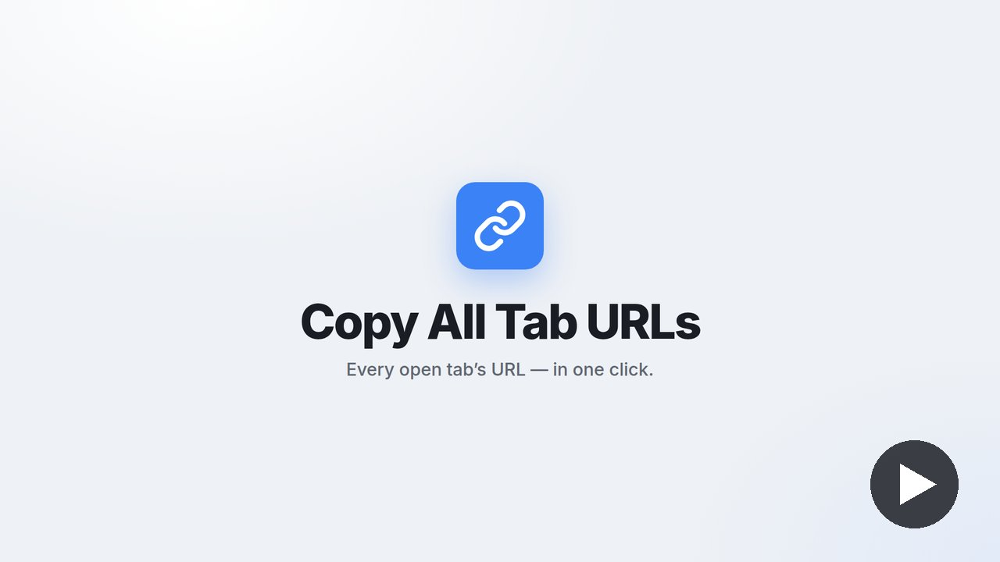

# Copy All Tab URLs

A Chrome extension (Manifest V3) that copies the URLs of your open tabs to the clipboard — one per line, ready to paste.

**Install:** [Chrome Web Store](https://chromewebstore.google.com/detail/ohiamlgdahmmkadngmcjiiedncmoegnd)　/　**Website:** [kat-log.github.io/copy-links](https://kat-log.github.io/copy-links/)

[日本語はこちら](#日本語)

## Features

- **Copy all tab URLs** — every tab in the current window, in one click.
- **Copy selected tab URLs** — select tabs with Ctrl / Cmd + click, then copy only those.
- **Custom buttons** — collect the links inside the current page that match a hostname and an optional pathname regex (e.g. every article on a list page).
- **Export / Import** — move your custom buttons between browsers as JSON.
- **English / 日本語** — switch the UI language from the popup's settings.
- **Local only** — links are collected in your browser; nothing is sent anywhere.

## Usage

1. Click the toolbar icon to open the popup.
2. Choose **Copy all tab URLs**, **Copy selected tab URLs**, or one of your custom buttons.
3. Paste anywhere.

To add or edit custom buttons, open the gear icon in the popup → **Manage custom buttons**.

| Field | Example | Notes |
| --- | --- | --- |
| Display name | `Copy post links` | A separate English name can be set. |
| Hostname | `blog.example.com` | Links must match this hostname exactly. A pasted URL is reduced to its hostname. |
| Pathname regex (optional) | `^/posts/[a-z0-9-]+$` | Tested against the URL path. Empty = all paths. |

Duplicate links are removed. If the clipboard cannot be written, the popup shows the links in a text area so you can copy them by hand.

## Permissions

- `tabs` — read the URLs of your tabs.
- `activeTab`, `scripting` — read the links in the current page for custom buttons.
- `storage` — save custom buttons and the language setting.

## Load unpacked (development)

1. Open `chrome://extensions` and turn on **Developer mode**.
2. Click **Load unpacked** and select this folder.

| File | Role |
| --- | --- |
| `manifest.json` | Manifest (MV3) |
| `popup.html` / `popup.js` / `popup.css` | Popup UI, tab URL collection, clipboard copy with fallbacks |
| `background.js` | Service worker: collects matching links in the active tab for custom buttons |
| `options.html` / `options.js` / `options.css` | Custom button settings, export / import |
| `storage.js` | Custom button storage and validation |
| `i18n.js`, `_locales/` | English / Japanese strings |

---

## 日本語

開いているタブの URL を、1行に1つずつクリップボードにコピーする Chrome 拡張機能（Manifest V3）です。

**インストール：** [Chrome ウェブストア](https://chromewebstore.google.com/detail/ohiamlgdahmmkadngmcjiiedncmoegnd)　／　**紹介動画：** [YouTube](https://youtu.be/eUM-HaXOtsk)　／　**紹介ページ：** [kat-log.github.io/copy-links](https://kat-log.github.io/copy-links/)

### できること

- **全タブの URL をコピー**：今のウィンドウのタブをすべて、ワンクリックで。
- **選択中のタブの URL をコピー**：Ctrl / Cmd + クリックで選んだタブだけ。
- **カスタムボタン**：開いているページの中から、ホスト名と（任意の）パスの正規表現に合うリンクを集めてコピー（記事一覧ページの記事リンクなど）。初期状態で Qiita の記事リンク用のボタンが入っています。
- **エクスポート / インポート**：カスタムボタンを JSON で書き出し・読み込み。
- **日本語 / English**：ポップアップの設定（歯車）から切り替え。
- **外部送信なし**：リンクの収集はブラウザ内で完結します。

### 使い方

1. ツールバーのアイコンをクリックしてポップアップを開く
2. 「全タブのURLをコピー」「選択中のタブのURLをコピー」、またはカスタムボタンを押す
3. 好きな場所に貼り付ける

カスタムボタンの追加・編集は、ポップアップの歯車 →「カスタムボタンの管理」から。ホスト名は完全一致（URL を貼るとホスト名だけが取り出されます）、正規表現は URL のパス部分に対して判定し、空ならすべてのパスが対象です。重複したリンクは除かれます。クリップボードへの書き込みに失敗したときは、ポップアップにテキストエリアが出るので手動でコピーしてください。

### 権限

- `tabs`：タブの URL を読む
- `activeTab`、`scripting`：カスタムボタンで、表示中のページのリンクを読む
- `storage`：カスタムボタンと言語設定を保存する

### ローカルで読み込む

1. `chrome://extensions` を開き「デベロッパーモード」をオンにする
2. 「パッケージ化されていない拡張機能を読み込む」でこのフォルダを選ぶ
